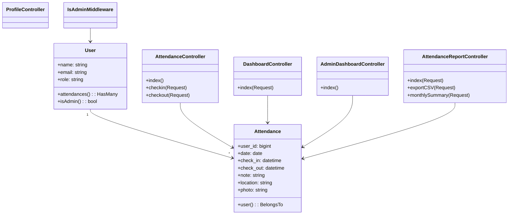

# Sistem Absensi Personel "lauraa"

Aplikasi ini adalah sistem absensi internal untuk pegawai/siswa yang membutuhkan bukti foto, lokasi, catatan, serta laporan yang bisa dipantau oleh admin. Proyek dibangun dengan Laravel 12 + Breeze (Blade & Tailwind) dan menambahkan middleware `is_admin` untuk memisahkan panel pengguna dan panel admin.

## Gambaran Umum Aplikasi Web
- Halaman awal berisi form autentikasi Breeze (register, login, lupa password) sehingga pengguna baru dapat membuat akun sendiri atau menggunakan akun yang disiapkan lewat seeder.
- Setelah login pengguna diarahkan ke dashboard ringkas yang memperlihatkan aktivitas absensi terakhir dan tombol cepat menuju halaman absensi harian.
- Halaman absensi memungkinkan unggah foto (max 5 MB) sebagai bukti visual, mengisi keterangan ruangan/lokasi, lalu mencatat check-in dan check-out yang disimpan ke tabel `attendances`.
- Admin memiliki dashboard terpisah (`/admin/dashboard`) untuk memantau total pengguna, jumlah absensi hari ini, riwayat terbaru, serta halaman laporan dengan filter tanggal/pengguna + ekspor CSV.
- Semua data absensi dapat dianalisis per pengguna melalui ringkasan bulanan dan statistik (hadir, absen, terlambat, persentase kehadiran) sehingga memudahkan audit kehadiran.

## Fitur Utama
### Fitur Pengguna
- Register, login, verifikasi email, reset password menggunakan alur standar Breeze.
- Dashboard personal berisi aktivitas terakhir yang menampilkan status hadir/absen, jam masuk/keluar, serta lokasi.
- Halaman absensi dengan unggah foto, catatan, dan lokasi. Frontend memberi pratinjau foto dan validasi ukuran/tipe.
- Tombol check-out terpisah yang mengisi kolom `check_out` untuk hari berjalan.
- Riwayat absensi paginasi beserta badge status hadir/terlambat yang memudahkan monitoring mandiri.

### Fitur Admin/Pimpinan
- Panel admin memakai middleware `auth` + `is_admin` sehingga hanya akun berperan `admin` yang dapat mengakses.
- Dashboard admin memperlihatkan jumlah user aktif, jumlah absensi hari ini, dan 10 data terbaru lengkap dengan foto/lokasi.
- Laporan absensi dengan filter rentang tanggal, filter pengguna, dan filter role (user/admin) plus statistik agregat.
- Ekspor CSV siap pakai untuk kebutuhan laporan manual maupun impor ke spreadsheet.
- Ringkasan bulanan yang menghitung hari kerja (Senin-Jumat), kehadiran, ketidakhadiran, keterlambatan, dan persentase setiap user.

### Fitur Teknis
- Penyimpanan foto bukti di disk `public` (`storage/app/public/attendance_photos`) dengan validasi ukuran/tipe file.
- Queue dan cache default menggunakan koneksi database sehingga mudah di-deploy tanpa Redis/Memcached.
- Seeder untuk membuat admin dan beberapa akun contoh, serta seeder tambahan (`AttendanceSeeder`) guna mengisi riwayat absensi realistis dengan jam random pagi/sore.
- Middleware `IsAdmin` yang mengandalkan method `User::isAdmin()` sehingga mudah diperluas jika ada role baru.

## Arsitektur & Teknologi
- **Backend**: Laravel 12, PHP 8.2, Breeze (Fortify + Blade + Tailwind), autentikasi sesi.
- **Frontend**: Blade layout, komponen Breeze, TailwindCSS, GSAP untuk animasi di dashboard/absensi.
- **Database**: MySQL/MariaDB (lihat skema di bawah), driver sesi + cache + antrian menggunakan tabel database.
- **Storage**: Disk `public` untuk foto absensi, `php artisan storage:link` diperlukan agar dapat diakses via `public/storage`.
- **Role & Middleware**: `auth`, `verified`, `is_admin` (alias ditambahkan via `AppServiceProvider`).
- **Queue**: `database` (lihat `.env`), siap diaktifkan dengan `php artisan queue:work` jika dibutuhkan.

## Alur Penggunaan Web
1. Pengguna membuka `/` lalu diarahkan ke `login` (atau `register` bila belum punya akun).
2. Setelah login, pengguna melihat dashboard personal dan dapat menuju halaman absensi.
3. Pada halaman absensi pengguna mengunggah foto terbaru, mengisi lokasi/catatan, lalu menekan tombol "Selesai Absensi" sehingga `check_in` terisi.
4. Riwayat hari tersebut muncul di tabel bawah. Apabila sudah selesai bekerja, pengguna menekan tombol "Akhiri" untuk mengisi `check_out`.
5. Admin login dengan akun `role=admin` kemudian membuka `/admin/dashboard` untuk melihat statistik realtime.
6. Melalui `/admin/attendance-report` admin dapat memfilter data, mencetak CSV, atau membuka `/admin/monthly-summary` untuk melihat statistik bulanan.

## Dokumentasi Modul & Rute Penting
| Role | Method | Endpoint | Controller@action | Penjelasan |
| --- | --- | --- | --- | --- |
| Guest | GET | `/` | view `auth.login` | Menampilkan form login default Breeze. |
| Guest | GET/POST | `/register` | `Auth\RegisteredUserController` | Membuat akun baru. |
| User | GET | `/dashboard` | `DashboardController@index` | Dashboard personal & aktivitas terbaru. |
| User | GET | `/attendance` | `AttendanceController@index` | Form absensi + riwayat pribadi. |
| User | POST | `/attendance/checkin` | `AttendanceController@checkin` | Menyimpan foto + check-in hari ini. |
| User | POST | `/attendance/checkout` | `AttendanceController@checkout` | Mengisi check-out hari ini. |
| User | GET/PATCH/DELETE | `/profile` | `ProfileController` | Edit profil, ganti password, hapus akun. |
| Admin | GET | `/admin/dashboard` | `Admin\DashboardController@index` | Statistik total user & absensi hari ini. |
| Admin | GET | `/admin/attendance-report` | `Admin\AttendanceReportController@index` | Laporan lengkap + filter. |
| Admin | GET | `/admin/attendance-report/export` | `AttendanceReportController@exportCSV` | Ekspor CSV rentang tanggal. |
| Admin | GET | `/admin/monthly-summary` | `AttendanceReportController@monthlySummary` | Ringkasan bulanan untuk semua user. |

## Instalasi & Konfigurasi Lokal
### Prasyarat
- PHP 8.2+
- Composer 2.x
- Node.js 18+ & npm
- MySQL/MariaDB (atau database lain yang kompatibel dengan konfigurasi Laravel)

### Langkah Setup Cepat
1. Clone proyek ini kemudian masuk ke direktori kerjanya.
2. Salin berkas contoh environment: `cp .env.example .env` lalu sesuaikan `APP_URL`, kredensial MySQL, serta opsi `SESSION_DRIVER`, `QUEUE_CONNECTION`, dsb.
3. Install dependensi backend: `composer install`.
4. Generate key aplikasi: `php artisan key:generate`.
5. Jalankan migrasi dan seeder dasar: `php artisan migrate --seed`. Tambahkan seeder riwayat bila diperlukan: `php artisan db:seed --class=AttendanceSeeder` (mendukung variabel `SEED_START_DATE`, `SEED_END_DATE`, `SEED_ATTENDANCE_DAYS`).
6. Buat symlink storage agar foto dapat diakses: `php artisan storage:link`.
7. Install dependensi frontend: `npm install` lalu jalankan `npm run dev` selama pengembangan atau `npm run build` untuk produksi.
8. Jalankan server lokal: `php artisan serve` dan (opsional) `php artisan queue:listen` jika ingin memproses antrean.

### Akun Contoh
- **Admin**: `admin@example.com` / `password`
- **User**: `rafi@example.com`, `dika@example.com`, `laura@example.com`, dll (password default: `password`).

### Pengujian
- Jalankan `php artisan test` untuk memastikan seluruh feature test dari Laravel tetap hijau.
- Pastikan route upload foto bekerja dengan menjalankan `php artisan storage:link` sebelum menguji form absensi.

## Skema Database
### Ringkasan Tabel
| Tabel | Kolom penting | Catatan |
| --- | --- | --- |
| `users` | `id`, `name`, `email`, `password`, `role`, timestamps | `role` default `user`; admin ditandai `role=admin`. |
| `attendances` | `id`, `user_id`, `date`, `check_in`, `check_out`, `note`, `location`, `photo`, timestamps | Unik per kombinasi `user_id` + `date`. Foto disimpan sebagai path. |
| `sessions` | `id`, `user_id`, `ip_address`, `user_agent`, `payload`, `last_activity` | Dipakai untuk driver sesi `database`. |
| `jobs`, `job_batches` | Standar Laravel queue database. |
| `cache`, `cache_locks` | Menyimpan cache dan lock jika `CACHE_STORE=database`. |

### SQL Ringkas
```sql
CREATE TABLE users (
  id BIGINT UNSIGNED AUTO_INCREMENT PRIMARY KEY,
  name VARCHAR(255) NOT NULL,
  email VARCHAR(255) NOT NULL UNIQUE,
  email_verified_at TIMESTAMP NULL,
  password VARCHAR(255) NOT NULL,
  role VARCHAR(50) NOT NULL DEFAULT 'user',
  remember_token VARCHAR(100) NULL,
  created_at TIMESTAMP NULL,
  updated_at TIMESTAMP NULL
);

CREATE TABLE attendances (
  id BIGINT UNSIGNED AUTO_INCREMENT PRIMARY KEY,
  user_id BIGINT UNSIGNED NOT NULL,
  date DATE NOT NULL,
  check_in TIMESTAMP NULL,
  check_out TIMESTAMP NULL,
  note VARCHAR(255) NULL,
  location VARCHAR(255) NULL,
  photo VARCHAR(255) NULL,
  created_at TIMESTAMP NULL,
  updated_at TIMESTAMP NULL,
  UNIQUE KEY unique_user_date (user_id, date),
  CONSTRAINT fk_attendances_user FOREIGN KEY (user_id) REFERENCES users(id) ON DELETE CASCADE
);
```

## Entity Relationship Diagram (ERD)


## UML (Class Diagram Simplified)


## Lisensi & Pengembangan Lanjut
Proyek ini mewarisi lisensi MIT dari Laravel. Silakan kembangkan lebih lanjut dengan menambahkan modul perizinan, integrasi geofencing, atau push notification. Kontribusi baru bisa dimulai dengan membuat branch fitur kemudian ajukan pull request.
